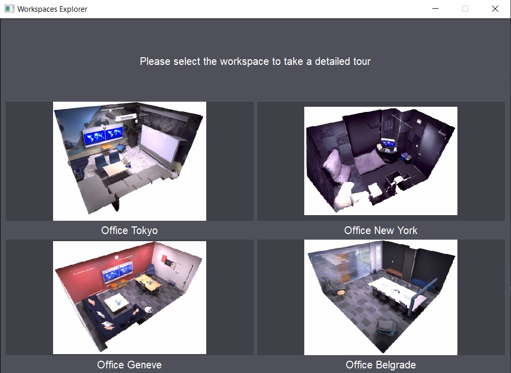
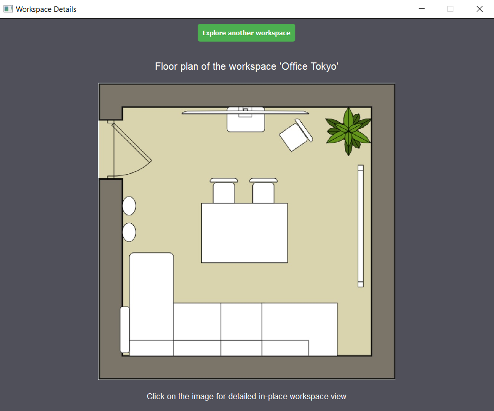
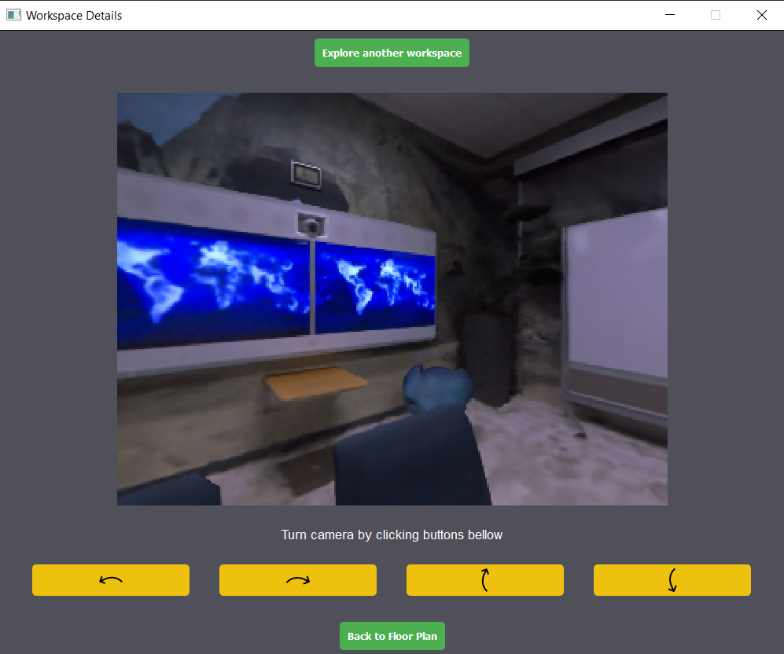

# NeRF-Workspaces-Explorer
 GUI application for Workspaces Exploration using NeRF model for complex scenes rendering.
 Optimized on Replica dataset, this repo uses NeRF method to render any view for selected workspaces.

 To run the application, use following command:

 `python main.py`
 
 This will open a window like following:
 

 By clicking on any listed workspace thumbnail images above, user can specify 
 workspace for detailed tour. Following window pops up:
 

 Workspace Details page shows one main image - floor plan of selected workspace and by clicking on any spot on floor plan image application will show default view into
 workspace, rendered using previously trained NeRF model, from the coordinates transformed using relative clicked spot coordinates.
 
 Application shows detailed inspection of workspace like on the following image:
 
 
 User can turn camera in the left-right or up-down motion by clicking the yellow buttons. 

 
